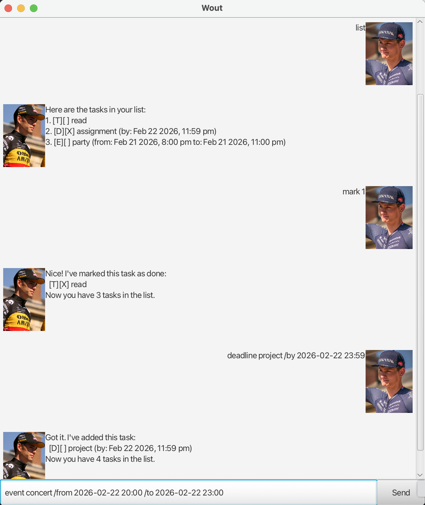

# Wout User Guide

**Wout** is a chatbot with a graphical user interface. 
It helps users manage todos, deadlines and events through simple commands.



Wout is designed to be:

- text-based
- easy to learn
- ~~FAST~~ _SUPER_ FAST to use

---
## Adding todos
Add a todo to keep track of tasks that need to be completed but have no specific deadline.
### Command format

```
todo DESCRIPTION
```
### Example usage

```
todo Buy groceries
```
### Expected outcome
Wout confirms that the todo has been added successfully and displays the updated number of tasks.

```
Got it. I've added this task:
  [T][] Buy groceries
Now you have 1 tasks in the list.
```

## Adding deadlines
Add a deadline to keep track of tasks that must be completed by a specific date.
### Command format

```
deadline DESCRIPTION /by yyyy-MM-dd HH:mm
```

### Example usage

```
deadline CS2103T assignment /by 2026-02-22 23:59
```

### Expected outcome

Wout confirms that the deadline has been added successfully and displays the updated number of tasks.

```
Got it. I've added this task:
  [D][] CS2103T assignment (by: Feb 22 2026, 11:59 pm)
Now you have 2 tasks in the list.
```

## Adding events
Add an event to keep track of activities that occur within a specific date and time.
### Command format
```
event DESCRIPTION /from yyyy-MM-dd HH:mm /to yyyy-MM-dd HH:mm
```
### Example usage

```
event concert /from 2026-02-22 20:00 /to 2026-02-22 23:00
```
### Expected outcome
Wout confirms that the event has been added successfully and displays the updated number of tasks.

```
Got it. I've added this task:
  [E][] concert (from: Feb 22 2026, 8:00 pm to: Feb 22 2026, 11:00 pm)
Now you have 3 tasks in the list.
```

## Listing tasks
List all tasks to view your current todos, deadlines and events.
### Command format
```
list
```
### Example usage
```
list
```
### Expected outcome
Wout displays a numbered list of all tasks, including their type (todo, deadline, event) and relevant details.
```
Here are the tasks in your list:
1.[T][] Buy groceries
2.[D][] CS2103T assignment (by: Feb 22 2026, 11:59 pm)
3.[E][] concert (from: Feb 22 2026, 8:00 pm to: Feb 22 2026, 11:00 pm)
```

## Deleting tasks
Delete a task to remove it from your list when it's no longer needed.
### Command format
```
delete TASK_NUMBER
```
### Example usage
```
delete 2
```
### Expected outcome
Wout confirms that the task has been deleted successfully and displays the updated number of tasks.
```
Noted. I've removed this task:
  [D][] CS2103T assignment (by: Feb 22 2026, 11:59 pm)
Now you have 2 tasks in the list.
```
## Marking tasks as done
Mark a task as done to indicate that it has been completed.
### Command format
```
mark TASK_NUMBER
```
### Example usage
```
mark 1
```
### Expected outcome
Wout confirms that the task has been marked as done successfully and displays the updated number of tasks.
```
Nice! I've marked this task as done:
  [T][x] Buy groceries
Now you have 2 tasks in the list.
```

## Marking tasks as not done
Mark a task as not done to indicate that it is still pending.
### Command format
```
unmark TASK_NUMBER
```
### Example usage
```
unmark 1
```
### Expected outcome
Wout confirms that the task has been marked as not done successfully and displays the updated number of tasks.
```
Ok, I've marked this task as not done yet:
  [T][] Buy groceries
Now you have 2 tasks in the list.
```

## Finding tasks
Find tasks to search for specific tasks in your list using keywords.
### Command format
```
find KEYWORD
```
### Example usage
```
find concert
```
### Expected outcome
Wout displays a list of tasks that match the keyword, including their type and relevant details.
```
Here are the matching tasks in your list:
1.[E][] concert (from: Feb 22 2026, 8:00 pm to: Feb 22 2026, 11:00 pm)
```

## Exiting Wout
Exit Wout when you are done managing your tasks.
### Command format
```
bye
```
### Example usage
```
bye
```
### Expected outcome
Wout says goodbye and terminates the program.
```
Bye. Hope to see you again soon!
```